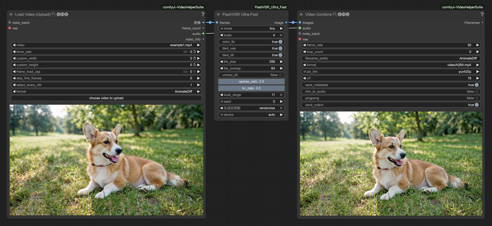

# ComfyUI-FlashVSR_Ultra_Fast
在低显存环境下运行 FlashVSR，同时保持无伪影高质量输出。  
**[[📃English](./README.md)]**

## 更新日志
#### 2025-10-31
- **新增:** 独立的 `infer_video.py` 脚本，无需 ComfyUI 即可处理视频
- **新增:** 多GPU并行处理 (`--multi_gpu`) - 自动将视频按帧分割到多个GPU
- **新增:** 自适应tile批处理 (`--adaptive_batch_size`) - 根据GPU显存动态调整tile并发数
- **新增:** GPU显存监控和优化，充分利用24-32GB显卡
- **新增:** 总耗时统计功能，便于性能监控
- **改进:** 视频读取增加OpenCV兜底，提升编解码器兼容性
- **修复:** 空帧处理和负维度错误

#### 2025-10-24
- 新增长视频管道, 可显著降低长视频放大的显存用量  

#### 2025-10-22
- 使用`Sparse_SageAttention`替换了`Block-Sparse-Attention`, 无需编译安装任何自定义内核, 开箱即用.  
- 支持在 RTX50 系列显卡上运行.

#### 2025-10-21
- 项目首次发布, 引入了`tile_dit`等功能, 大幅度降低显存需求  

## 预览


## 使用说明

### 独立推理脚本（新增！）

使用 `infer_video.py` 可在不使用 ComfyUI 的情况下直接处理视频：

```bash
python infer_video.py \
  --input ./inputs/video.mp4 \
  --output ./results/output.mp4 \
  --mode tiny \
  --scale 4 \
  --tiled_dit true \
  --tile_size 256 \
  --tile_overlap 64 \
  --multi_gpu \
  --adaptive_batch_size \
  --model_dir /path/to/FlashVSR
```

**关键参数：**
- **`--multi_gpu`**: 启用多GPU并行处理（按帧分割到各GPU）
- **`--adaptive_batch_size`**: 启用自适应tile批处理（根据可用显存动态调整）
- **`--model_dir`**: FlashVSR模型目录路径（默认：`/app/FlashVSR/examples/WanVSR/FlashVSR`）

详细优化指南请参阅 [OPTIMIZATION_GUIDE.md](./OPTIMIZATION_GUIDE.md)。

### ComfyUI 节点

- **mode（模式）：**  
  `tiny` → 更快（默认）；`full` → 更高质量  
- **scale（放大倍数）：**  
  通常使用 `4` 效果更好；如果显存不足，可使用 `2`  
- **color_fix（颜色修正）：**  
  使用小波变换方法修正输出视频的颜色偏差。  
- **tiled_vae（VAE分块解码）：**  
  启用后可显著降低显存占用，但会降低解码速度。  
- **tiled_dit（DiT分块计算）：**  
  大幅减少显存占用，但会降低推理速度。  
- **tile_size / tile_overlap（分块大小与重叠）：**  
  控制输入视频在推理时的分块方式。  
- **unload_dit（卸载DiT模型）：**  
  解码前卸载 DiT 模型以降低显存峰值，但会略微降低速度。  

## 安装步骤

#### 安装节点:
```bash
cd ComfyUI/custom_nodes
git clone https://github.com/lihaoyun6/ComfyUI-FlashVSR_Ultra_Fast.git
python -m pip install -r ComfyUI-FlashVSR_Ultra_Fast/requirements.txt
```
> 📢: 要在RTX20系或更早的GPU上运行, 请安装`triton<3.3.0`:  

> ```bash
# Windows
python -m pip install -U triton-windows<3.3.0
# Linux
python -m pip install -U triton<3.3.0
```

#### 模型下载:
- 从[这里](https://huggingface.co/JunhaoZhuang/FlashVSR)下载整个`FlashVSR`文件夹和它里面的所有文件, 并将其放到`ComfyUI/models`目录中。  

```
├── ComfyUI/models/FlashVSR
|     ├── LQ_proj_in.ckpt
|     ├── TCDecoder.ckpt
|     ├── diffusion_pytorch_model_streaming_dmd.safetensors
|     ├── Wan2.1_VAE.pth
```

## 性能优化

### 多GPU并行处理
对于拥有2+个GPU的系统，启用 `--multi_gpu` 可获得接近线性的加速：
- 自动将视频帧分割到可用GPU
- 每个GPU独立处理视频片段
- 结果无缝合并，处理重叠区域

### 自适应批处理大小
启用 `--adaptive_batch_size` 最大化GPU利用率：
- 根据可用显存动态调整tile批处理大小
- 对于32GB GPU，可同时处理6-16个tiles
- 如果显存变化，处理过程中自动重新平衡

**预期性能：**
- **双GPU + 自适应批处理**: 相比单GPU提升3-5倍
- **显存使用**: 32GB GPU峰值使用20-25GB（未优化时约13GB）

## 致谢
- [FlashVSR](https://github.com/OpenImagingLab/FlashVSR) @OpenImagingLab  
- [Sparse_SageAttention](https://github.com/jt-zhang/Sparse_SageAttention_API) @jt-zhang
- [ComfyUI](https://github.com/comfyanonymous/ComfyUI) @comfyanonymous
